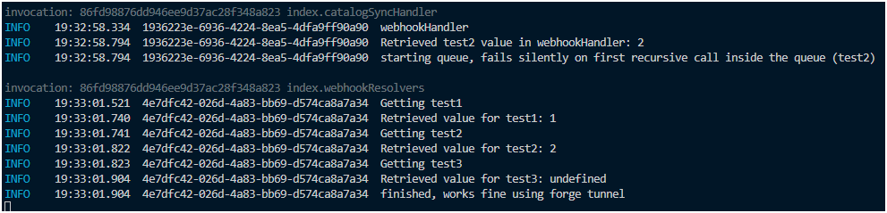
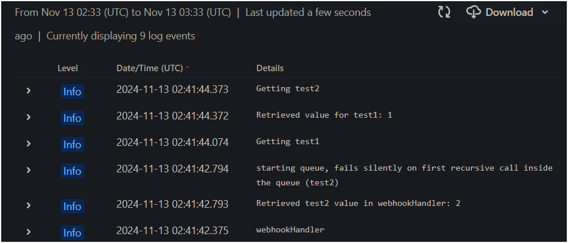

# Reproducing Storage.get Issue in QueueProcessor

## Overview
This repository contains a sample application that demonstrates an issue with the `storage.get` method when it is called during a recursive call in the `queueProcessor` function. The issue arises when the application is deployed to the Forge platform, while it works as expected when running with `forge tunnel`.

## Steps to Reproduce

1. **Set Up the Environment**
   - Ensure you have the necessary dependencies installed and configured for your Forge application.

2. **Run with Forge Tunnel**
   - Start the application using `forge tunnel`.
   - Trigger the `catalogSyncHandler` which will initiate the queue processing.

3. **Observe Behavior**
   - The `queueProcessor` function will successfully retrieve values from storage during its recursive calls.
   - You should see logs indicating that values for `test1`, `test2`, and subsequent keys are retrieved correctly.

4. **Deploy to Forge Platform**
   - Deploy the application to the Forge platform.
   - Trigger the `catalogSyncHandler` again.

5. **Send a Webhook Request**
   - Use `curl` to send an empty object as a payload to the configured webhook URL:
     ```bash
     curl -X POST <YOUR_WEBHOOK_URL> -H "Content-Type: application/json" -d '{}'
     ```

6. **Observe the Issue**
   - During the recursive calls in `queueProcessor`, the `storage.get` method will fail to retrieve the expected values.
   - This results in unexpected behavior and logs indicating that the values are not being retrieved.

Forge Tunnel Logs:


Forge Deploy Logs:


## Conclusion
This issue highlights a discrepancy between local development using `forge tunnel` and the behavior observed when the application is deployed to the Forge platform. Further investigation is needed to understand the underlying cause and to implement a fix.

Please refer to the code in `src/compassProcessor.ts` and `src/resolvers/webhookResolver.ts` for the implementation details of the `queueProcessor` and the webhook handler.

